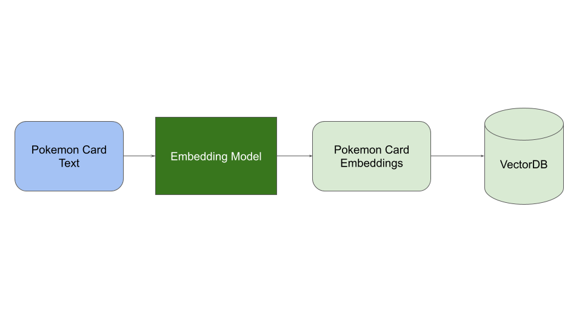
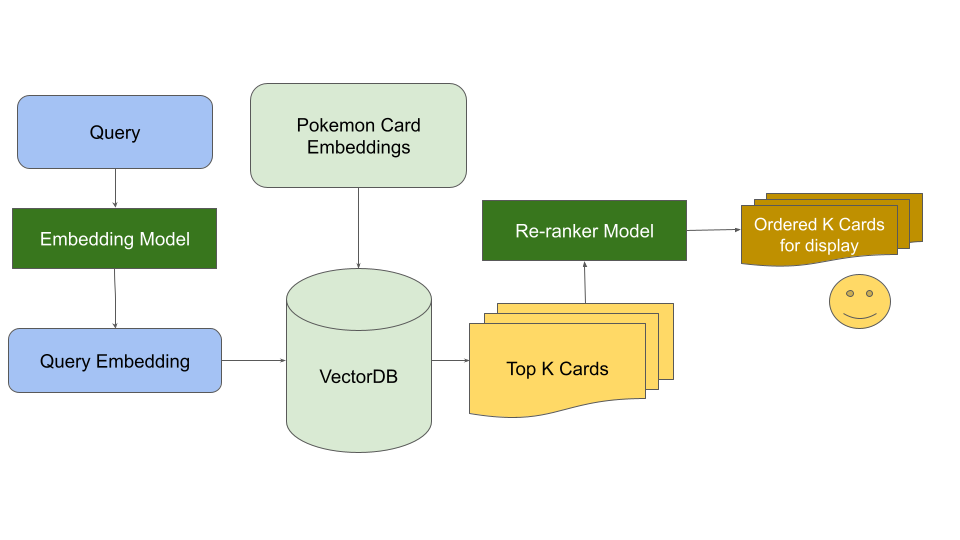

# [Pokemon Card Explorer](https://pokemoncards.streamlit.app/)

A simple semantic vector search engine over all **13000+ trading cards** ever to be released by Niantic, using a very straightforward stack including **Pinecone** (for Vector Database), **OpenAI** (for embeddings), **Cohere** (for Re-ranking) and **Streamlit** (for deployment).

Data Augmentation via web-scrapping was done to improve the search accuracy. Web-scraping was done using **requests** and **BS4**. 


# Motivation 🤔

Why? 'cause WHY NOT!

Any pokemon fan would agree 😌


# Implimentation 🛠️

The entire implementation can be divided into the following parts: 

- Data Preparation Step
- Data Injestion Step
- Query Step

## Data Preparation Step

The original [Pokemon Cards dataset](https://huggingface.co/datasets/TheFusion21/PokemonCards) is available on HuggingFace (uploaded by TheFusion21 💙) which has a 13.1K rows, containing the following information:

```json
{
    "id": ... , 
    "image_url" : ... , 
    "caption" : ... ,
    "name" : ... , 
    "hp" : ... , 
    "set_name" : ... 
}
```

The ideal candidate to be converted to embeddings would be the `name + caption` which is what I did in `version 1`, but noticed that it sometimes made some errors -- it wasn't able to identify pokemon accurately based on description and needed longer descriptions for better accuracy. 

The data doesn't contain what the pokemon look like, which is what the expected average case user will end up querying. So the conclusion was that the data needed to be augmented. 

I used [PokemonDB](https://pokemondb.net/) pages of individual pokemon, extracted data and images of the pokemon and created a supplementary dataset. All of this was done using **BS4** and **requests**. 

Further information on "how" the pokemon looked like was extracted using BLIP to caption images of pokemon extracted through the PokemonDB. 

The entire pipeline can be visualized through the diagram below. 


The final supplemented data, a.k.a Pokemon Cards++, had the following fields: 

```json
{
    "id": ... , 
    "card_image_url" : ... , 
    "caption" : ... ,
    "name" : ... , 
    "hp" : ... , 
    "set_name" : ...,
    "poke_image_url" : ... , 
    "poke_image_caption" : ... , 
    "pokedex_entries" : ... , 
    "pokedb_intro_text" : ... 
}
```

And the final text used for generating the embeddings was `name + caption + poke_image_caption + pokedb_intro_text + pokedex_entries` which allowed for a more holistic embedding to be generated for each pokemon. 

## Data Injestion Step

Once the embeddings for all the data have been created, you need to put it in a vector database storage for quick semantic similarity search (using HNSWor other approx algo). Something I used for this step was Pinecone, which made it really easy to do. 

Essentially, this can be summarized by the diagram below. 




## Query Step


In the query step, the user provided question is simply passed into the **same** embedding model that was used in the injestion and sent to the vectorDB for semantic search against the Card Embeddings, which then gives out the K nearest matches for the query embeddings. Now, the k-nearest matches are sent to a re-ranker model which rankes each of the matches against a query on the match relevancy and provides us our final output, ranked Pokemon Cards!




## That's all Folks!


# FAQ

## How much does it cost to run and maintain this site?
Glad you asked! It costs me nothing to keep the Pinecone Vector DB running (but it might shutdown in a few days if not queried) and for CO:here's reranking API which is free. OpenAI charges me per token but the value is quite affordable. It cost me about $2 to get embeddings for the entire dataset. So this entire project just costs me $2 and about 3 days of time. 

## The site is down with a error, why is it not running?
Probably because Pinecone deleted the index, which means that I would have to re-upload the embeddings on Pinecone again. Pinecone deletes indices that haven't been used in a week under the free version. 

## You're so awesome, how can I be like you?
You can't. Sorry.

# Acknowledgements 

Thank you to **Pokemon** for making my childhood special! 💙


